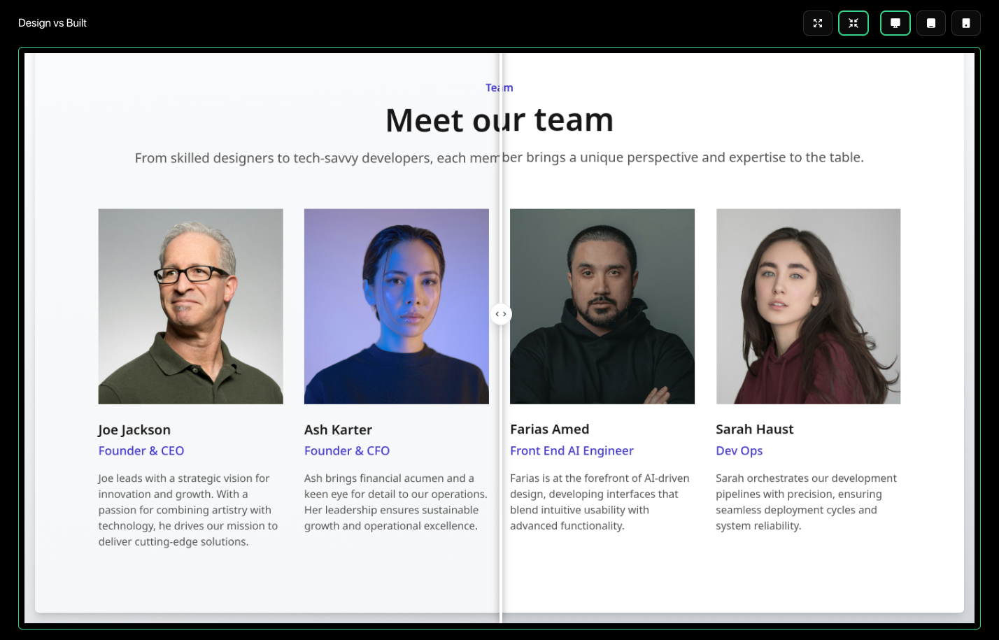

#  [designmatch](https://designmatch.vercel.app/)
A design comparison tool for developers.

## [Live Demo](https://designmatch.vercel.app/)



## Getting Started

First, run the development server:

Clone the repository:
```bash
https://github.com/io-oseinana/designmatch.git
```

cd into the project directory

and

```bash
npm run dev
# or
yarn dev
# or
pnpm dev
# or
bun dev
```

Open [http://localhost:3000](http://localhost:3000) with your browser to see the result.

## Built with
- [Next.js](https://nextjs.org/)
- [Tailwind CSS](https://tailwindcss.com/)
- [Shadcn UI](https://shadcn.com/)
- [IndexedDB](https://developer.mozilla.org/en-US/docs/Web/API/IndexedDB_API)
- [idb](https://www.npmjs.com/package/idb)
- [Puppeteer](https://pptr.dev/)

## Features
- Upload design images (PNG, JPG)
- Live URL like for generating screenshots
- Compare designs side by side
- Fullscreen mode for detailed comparison
- Component view mode
- Store designs locally using IndexedDB
- Breakpoints for responsive design comparison

## License
[MIT](LICENSE)

## Acknowledgements
- Used [GreatFrontend](https://www.greatfrontend.com/) project design component for the comparison view.

## Contributing
Contributions are welcome! Please open an issue or submit a pull request for any improvements or bug fixes.

## Contact
For any questions or suggestions, please open an issue on the GitHub repository.

## Star us
If you find this project useful, please give it a star on GitHub! ⭐